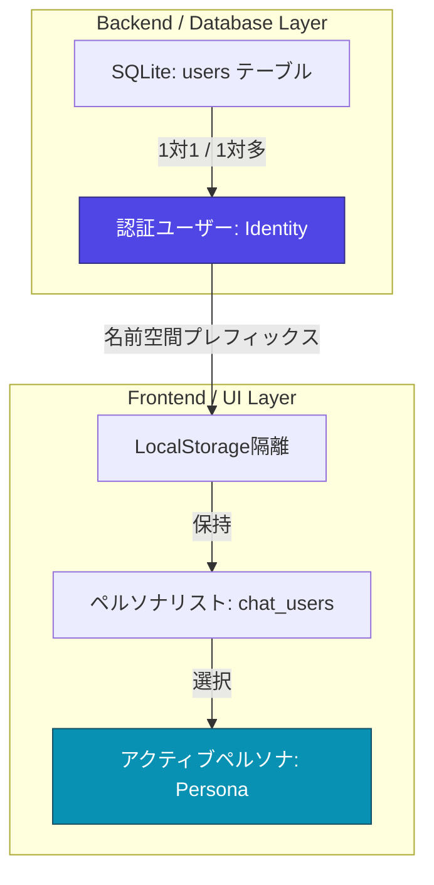

# ユーザーシステム全体像 (User System Overview)

本ドキュメントでは、Ultraviolet AI Chat における「ユーザー」という概念の全体像と二重構造について解説します。

---

## 1. ユーザーシステムの二重構造

Ultraviolet AI Chat には、見た目は同じ「ユーザー」として表現されますが、システム内部では**「認証ユーザー（Identity）」**と**「表示用ペルソナ（Persona）」**という2つの全く異なる概念（レイヤー）が存在します。

これらは互いに関連していますが、役割やスコープが完全に分離されています。

### 二重構造の比較一覧

| 区分 | 認証ユーザー (Identity) | 表示用ペルソナ (Persona) |
| :--- | :--- | :--- |
| **定義** | システムへのログインおよびセキュリティ境界となる実体。 | チャット画面上で会話の発言者やUI上の表示となる役割。 |
| **保存先** | バックエンド SQLite データベース (`users` テーブル) | フロントエンド `LocalStorage` (`${authUsername}_chat_users`) |
| **主な用途** | - アカウント認証 (ログイン/サインアップ) - データ（メモ・エージェント）の所有権隔離 | - チャットメッセージの送信元名とアバター表示 - メモの作成者・更新者としての選択項目 |
| **作成制限** | ログイン画面から誰でも新規作成（サインアップ）可能。 | 通常ユーザーは自分のみ。管理者 (`admin` ロール) のみ複数作成可能。 |
| **データ隔離** | ユーザー名ごとにデータベースレコードが厳格に分離される。 | 認証ユーザーごとの `LocalStorage` 内で個別に保持される。 |

---

## 2. 各概念のエントリポイントと関連ファイル

このユーザーシステムに関連する仕様やソースコードは、以下のファイルに分散して配置されています。各ファイルを参照する際のポータルとして利用してください。

### ① 機能仕様・詳細ドキュメント
- **認証ユーザー機能仕様**: [User_Identity_Details.md](file:///c:/CodeRoot/solid_chat_adk/docs/app/User_Identity_Details.md)
  - ログイン・サインアップや、SQLite・LocalStorage等におけるデータ分離・セキュリティ隔離仕様を説明しています。
- **表示用ペルソナ機能仕様**: [User_Persona_Details.md](file:///c:/CodeRoot/solid_chat_adk/docs/app/User_Persona_Details.md)
  - ペルソナの切り替え、管理権限、UI描画、およびユーザーメモとの連携仕様を説明しています。
- **SQLite データベース仕様**: [sqlite_database.md](file:///c:/CodeRoot/solid_chat_adk/docs/system/sqlite_database.md)
  - バックエンド側の認証テーブル定義と、`owner` カラムを使用したデータ分離ロジックを解説しています。
- **LocalStorage 仕様**: [local_storage.md](file:///c:/CodeRoot/solid_chat_adk/docs/system/local_storage.md)
  - フロントエンド側での認証キーおよびプレフィックス付きのユーザー固有データ構造について説明しています。

### ② フロントエンド実装コード
- **認証画面**: [LoginScreen.tsx](file:///c:/CodeRoot/solid_chat_adk/src/components/LoginScreen.tsx)
  - ログイン、新規ユーザー登録、アバター絵文字選択を提供する UI コンポーネント。
- **プロファイル管理**: [UserSettings.tsx](file:///c:/CodeRoot/solid_chat_adk/src/components/Settings/UserSettings.tsx)
  - ペルソナの切り替え、新規ペルソナの追加、削除を行う管理者向けのコントロールパネル UI コンポーネント。
- **状態管理ストア**: [appState.ts](file:///c:/CodeRoot/solid_chat_adk/src/store/appState.ts)
  - ログイン状態（`authUsername` 等）やアクティブなペルソナ（`activeUser`）の制御ロジックを実装しています。

### ③ バックエンド実装コード
- **サーバーエントリポイント**: [server.ts](file:///c:/CodeRoot/solid_chat_adk/server.ts)
  - セキュリティ用 HTTP ヘッダー `X-User-Identity` の検証や、認証 API の実装を含んでいます。
