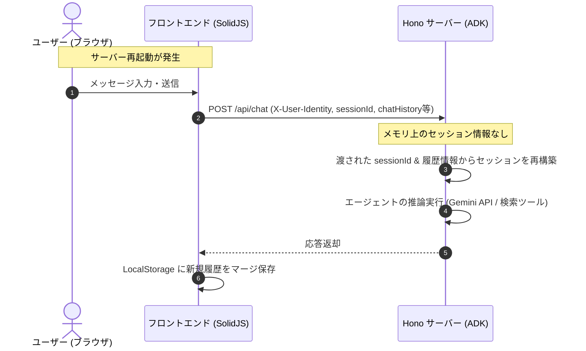

# Ultraviolet AI Chat — バックエンド In-Memory 保存仕様 (Backend In-Memory Storage Specification)

本ドキュメントでは、バックエンド（Hono サーバー）および Google Agent Development Kit (`@google/adk`) が行うメモリ内保存（InMemory）の追跡範囲、役割、およびライフサイクル仕様について説明します。

---

## 1. 役割と目的

対話型 AI エージェントを自律的に動作させるには、会話コンテキスト（短期記憶）、過去の行動ログ（記憶サービス）、および生成物（アーティファクト）の高速な参照・更新が必要です。

本システムでは、これらを高速に追跡するため、`@google/adk` の **InMemory** 各種サービスを利用してサーバー側の揮発性メモリ上で動的に管理しています。

---

## 2. InMemory サービスの構成

バックエンドの `@google/adk` ランナーは、以下の3つの主要なメモリサービスをグローバルまたはセッション単位で保持しています。

### ① `InMemorySessionService`
* **役割**: エージェントとユーザー間の「対話セッション」の状態を追跡します。
* **データ内容**: セッションID、現在のスレッド情報、セッション内の状態ステータス。
* **特徴**: ユーザーから渡される `sessionId` に基づいて、エージェントが過去の複数ターンの会話の流れを考慮して返答を生成できるようにするためのコンテキスト管理を行います。

### ② `InMemoryArtifactService`
* **役割**: エージェントの実行プロセス中に生成される「アーティファクト」（プラン、タスクの実行結果、一時的なドキュメントなど）を保持します。
* **特徴**: 自律型エージェントが、自身で生成したアウトプットを後続のステップで参照する際のデータプールとして機能します。

### ③ `InMemoryMemoryService`
* **役割**: エージェントの「文脈記憶（セッションをまたぐ長期・中期的な関係性やユーザー固有情報）」を追跡・抽出します。
* **特徴**: エージェント自身が過去の振る舞いから学習・記憶を蓄積できるようにするための揮発性記憶レイヤーです。

---

## 3. ライフサイクルと復旧メカニズム (Resilience)

> [!WARNING]
> **揮発性とデータの消失**
> バックエンドの Hono サーバープロセスが再起動（デプロイ作業、サーバーのクラッシュ、ローカル開発中のファイル保存によるライブリロードなど）されると、**InMemory 上のコンテキスト、セッション状態、アーティファクトデータは完全に消失します**。

この制限に対し、システムは以下の**復旧ロジック**によって耐障害性を担保しています。

1. **フロントエンド LocalStorage への履歴永続化**:
   会話履歴の本体は、メッセージが往復するたびにフロントエンドの `chat_history_${sessionId}` キーの下に JSON 文字列として LocalStorage に完全に永続化されます。
2. **オンデマンドのセッション自動再構築**:
   サーバー再起動後にユーザーが新しいチャットメッセージを送信すると、リクエストボディに `sessionId` や現在のシステム指示（`instruction`）、および過去のやり取りが送信されます。
3. **シームレスな体験**:
   バックエンドはメモリが空の状態であっても、渡されたセッションIDに対応する ADK `Runner` と対話履歴の文脈をその場で自動的に再構築します。そのため、ユーザーはサーバーの再起動を意識することなく、過去の文脈を維持したまま会話を継続できます。
